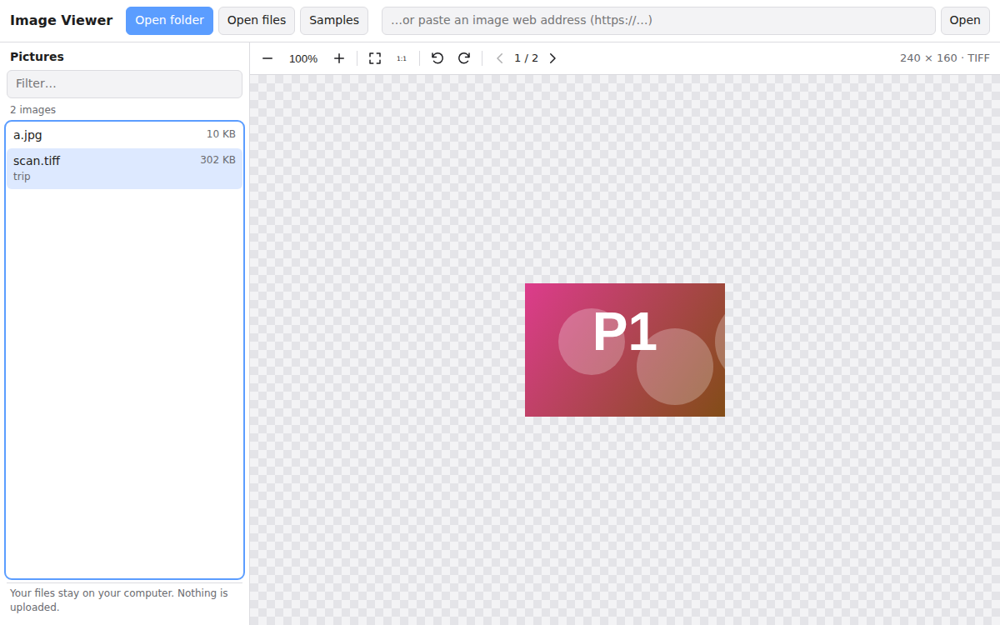

# Image Viewer

Open a folder of images, see them as a list, and click one to view it in a popup. Works with PNG, JPG, SVG, WebP, BMP, GIF, AVIF, ICO and TIFF (including multi-page TIFF).

**Live app:** https://sudheernookala.github.io/Imageviewer/



The viewer is a separate, drop-in web component (`<image-viewer>`), so you can reuse it in your own web app.

**Contents**

- [Using the app](#using-the-app)
- [Supported formats](#supported-formats)
- [Set up](#set-up): [run it on your computer](#run-the-app-on-your-computer) · [deploy to GitHub Pages](#deploy-to-github-pages) · [deploy to GitLab Pages](#deploy-to-gitlab-pages) · [Node version](#node-version-type-a-folder-path)
- [Use the viewer in your own app](#use-the-viewer-in-your-own-app)

## Using the app

1. The app opens with a list of sample images.
2. Click **Open folder** to list all images in a folder on your computer, including subfolders. Or click **Open files** to pick single images (use this on phones).
3. Click an image to open it in the popup viewer.
4. Close the popup with **Esc**, the **✕** button, or a click on the dark area around it.

Your files stay on your computer. The app reads them inside your browser and uploads nothing.

**Unsupported files:** if a folder or your selection contains files that are not a [supported format](#supported-formats) (for example `.docx`, `.step`, `.psd`), the app lists the images it can open and shows a yellow message naming the skipped files. If none of the files are supported, nothing changes and a red message explains why. Hidden system files such as `.DS_Store` are ignored without a message.

**In the list:** type in **Filter by name** to narrow it down. ↑ / ↓ move through the list and **Enter** opens the image.

**In the popup:**

| Action | How |
|---|---|
| Next / previous image | **Prev** / **Next** buttons, or ← / → |
| Zoom | **+** / **−** buttons, mouse wheel, or pinch |
| Move a zoomed image | Drag it |
| Fit to window / actual size | Toolbar buttons |
| Rotate | Toolbar buttons |
| Pages of a multi-page TIFF | ‹ / › in the toolbar |

Keyboard shortcuts inside the image: click the image first, then use + / − to zoom, 0 to fit, 1 for actual size, R / Shift+R to rotate, Page Up / Page Down for TIFF pages, and the arrow keys to move the image. While the image has focus, ← / → move it instead of switching images; use **Prev** / **Next** then.

### Open folder in each browser

| Browser | What happens |
|---|---|
| Chrome, Edge, Opera (desktop) | A folder picker opens. Files are read only when you open them. |
| Firefox, Safari (desktop) | A folder "upload" dialog opens. Despite the wording, nothing is uploaded. |
| Phones and tablets | Mobile browsers can't pick folders. Use **Open files**. |
| The app embedded in another page | Uses the "upload" style dialog, because browsers block the folder picker there. |

The app can't open a folder from a typed path like `C:\Photos`. Browsers don't let websites read files by path, so you pick the folder instead. If you need typed paths, use the [Node version](#node-version-type-a-folder-path).

Very large folders: the list stops at 20,000 images and shows 1,000 rows at a time. Use the filter to find the rest.

## Supported formats

| Format | Support |
|---|---|
| PNG, APNG, JPEG/JPG, GIF, WebP, AVIF, BMP, ICO, SVG | Every modern browser |
| TIFF / TIF, including multi-page | Every modern browser. The viewer decodes TIFF itself with [UTIF.js](https://github.com/photopea/UTIF.js). |
| HEIC / HEIF, JPEG XL | Safari only. Other browsers show a "cannot display" message. |
| Camera RAW (CR2, NEF, ARW, DNG), PSD, EXR | Not supported. These need a converter on a server. |

A TIFF file with the wrong extension still opens, because the viewer checks the file's first bytes. Very large TIFFs (hundreds of megapixels) are slow, because they are decoded in the browser.

## Set up

### Project layout

| Folder / file | What it is |
|---|---|
| `angular/` | The web app (Angular 21). This is what GitHub Pages hosts. |
| `public/viewer/` | The `<image-viewer>` component, shared by both apps. `vendor/` holds the TIFF decoder. |
| `samples/` | The sample images the app shows first. |
| `server.js`, `public/` | The Node version (type a folder path). |
| `.github/workflows/pages.yml` | Builds and publishes the app to GitHub Pages. |
| `.gitlab-ci.yml` | The same for GitLab Pages. |

### Run the app on your computer

You need [Node.js](https://nodejs.org/) 20.19+, 22.12+ or 24+.

```bash
cd angular
npm install
npm start          # opens at http://localhost:4200
```

To build the files for hosting:

```bash
npm run build      # output: angular/dist/image-viewer-ui/browser
```

Both commands first copy `samples/`, the TIFF decoder and this README (for the in-app guide) into `angular/public/`.

### Change the sample images

Add or remove images in the `samples/` folder and deploy again. No code change is needed. The samples are public on the hosted site, so don't put private images there.

### Deploy to GitHub Pages

The site is published from the **`dev`** branch.

1. One-time, in the GitHub repository:
   - **Settings > Pages > Build and deployment > Source:** choose **GitHub Actions**. Do not choose "Deploy from a branch": that publishes this README as the home page instead of the app.
   - **Settings > Environments > github-pages > Deployment branches and tags:** allow `dev`.
2. Push to `dev`. The workflow in `.github/workflows/pages.yml` tests, builds and publishes the app. You can also run it by hand from the **Actions** tab (choose the `dev` branch).
3. After about a minute the app is at `https://<user>.github.io/<repo>/`. For this repository that is https://sudheernookala.github.io/Imageviewer/.

Other branches and pull requests are built and tested, but not published. To publish from another branch, change `'dev'` in the two `if:` lines of `.github/workflows/pages.yml`.

If the home page shows this README instead of the app, the Pages source is set to "Deploy from a branch". Switch it to **GitHub Actions** and run the workflow again. If the publish step fails within seconds, `dev` is not allowed in the `github-pages` environment (step 1).

### Deploy to GitLab Pages

1. Push the repository to a GitLab project.
2. Merge into the default branch (usually `main`). The `pages` job in `.gitlab-ci.yml` only runs there.
3. When the pipeline passes, open **Deploy > Pages** in the GitLab project to find the address.

The app works at any address or sub-folder without changes.

### Show the web-address box

Opening an image from a web address is built but hidden. To show it, set `SHOW_URL_INPUT = true` in `angular/src/app/app.ts`. Many websites don't allow other sites to load their images, so it won't work for every address.

### Node version (type a folder path)

A simpler version that runs on your own computer, where you type a folder path. It needs Node.js 18+ and no `npm install`.

```bash
node server.js                          # allowed folder = your home folder
node server.js --root /path/to/pictures # only allow this folder
node server.js --root samples           # try it with the sample images
```

Open http://127.0.0.1:3000 and type a path such as `/home/me/Pictures` or `C:\Users\me\Pictures`. A file path also works: it opens that file's folder and shows the file.

Options (or environment variables): `--root` (`IMAGE_ROOT`), `--port` (`PORT`, default 3000), `--host` (`HOST`, default `127.0.0.1`).

Security:

- It only reads inside the `--root` folder. Paths with `..` and links pointing outside are refused.
- It only sends image files, never other files.
- It only accepts connections from your own computer by default. Don't use `--host 0.0.0.0` on a shared network: there is no login.
- SVG files are sent with rules that stop scripts inside them from running.

### Run the tests

```bash
npm test           # in the repository root: tests for the Node version
```

## Use the viewer in your own app

### Any web page

Copy the `public/viewer/` folder into your project, including `vendor/`.

```html
<script type="module" src="viewer/image-viewer.js"></script>

<image-viewer src="photos/cat.tif" style="height: 500px"></image-viewer>
```

It accepts an image URL, or a `File`, `Blob` or `ArrayBuffer`, so it works without a server:

```html
<input type="file" accept="image/*,.tif,.tiff" id="pick">
<image-viewer id="viewer" style="height: 500px"></image-viewer>
<script type="module">
  import './viewer/image-viewer.js';
  const viewer = document.getElementById('viewer');
  document.getElementById('pick').onchange = (e) => viewer.load(e.target.files[0]);
</script>
```

If a bundler (Angular, Vite, webpack) moves `image-viewer.js`, tell it where the `vendor/` files are served: `ImageViewer.vendorBase = 'viewer-vendor/';`

### Angular

Copy `angular/src/app/image-viewer/image-viewer.component.ts` and the `public/viewer/` folder, fix the import path, serve the `vendor/` files as assets, and set `ImageViewer.vendorBase`. Then:

```html
<app-image-viewer [source]="fileOrUrl" [filename]="name"
                  (loaded)="onLoaded($event)" (failed)="onError($event)" />
```

`source` takes a URL, a `File`/`Blob`, or `null` to clear. To zoom or rotate from code, get the component with `viewChild` and call `.viewer.zoomIn()`, `.viewer.rotate(90)` and so on.

### Viewer API

| | |
|---|---|
| **Attributes** | `src` (image URL) · `filename` (name used to detect the type when the URL has no extension) · `no-toolbar` (hide the toolbar) |
| **Methods** | `load(source, { filename })` · `clear()` · `zoomIn()` · `zoomOut()` · `zoomTo(scale)` · `fit()` · `actualSize()` · `rotate(deg)` · `setPage(index)` |
| **Property** | `state` → `{ width, height, scale, rotation, page, pages, format }` |
| **Events** | `imageload` (detail = `state`) · `imageerror` (detail = `{ message }`) |
| **Static** | `ImageViewer.vendorBase`: where the TIFF decoder files are served |
| **Styling** | CSS variables `--iv-bg`, `--iv-fg`, `--iv-muted`, `--iv-toolbar-bg`, `--iv-border`, `--iv-accent`, `--iv-checker`, `--iv-error`; parts `::part(toolbar)`, `::part(stage)`, `::part(image)` |

### Node server API

- `GET /api/list?path=<folder or file>` → `{ root, path, parent, selected, dirs: [{name, path}], files: [{name, path, size, modified, type}] }`
- `GET /api/file?path=<file>` → the image bytes with the correct `Content-Type`
