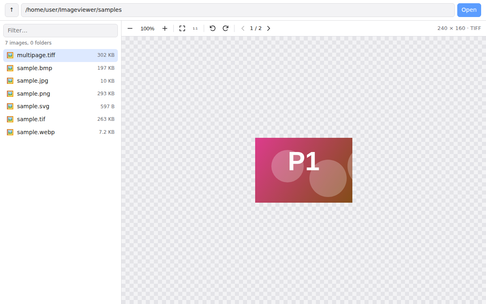

# Image Viewer

A small example app: type a folder (or file) path, see the images in it, click one to view it.

The viewer itself is a separate, drop-in web component (`<image-viewer>`) so you can reuse it in any other web app, with or without this server.

There are two UIs using the same viewer:

| | Plain HTML + Node server (`server.js`, `public/`) | Angular (`angular/`) |
|---|---|---|
| How you choose images | Type a folder path | Pick a folder / files, or paste a URL |
| Needs a server | Yes (Node) | No — static site |
| Hosting | Your machine | GitLab Pages (see below) |

See [angular/README.md](angular/README.md) for the Angular app.

## Deploy the Angular UI to GitHub Pages

`.github/workflows/pages.yml` builds the Angular app and publishes it on every push to the default branch.

1. One-time: in the GitHub repo open **Settings > Pages**, and under **Build and deployment > Source** choose **GitHub Actions**.
2. Push to the default branch (or run the workflow from the **Actions** tab).
3. The site is at `https://<user>.github.io/<repo>/`, for this repo https://sudheernookala.github.io/Imageviewer/.

## Deploy the Angular UI to GitLab Pages

`.gitlab-ci.yml` builds the Angular app and publishes it. Steps:

1. Push this repository to a GitLab project.
2. Merge to the default branch (usually `main`). The `pages` job only runs there; other branches only run the `test` job.
3. When the pipeline is green, open **Deploy > Pages** in the GitLab project to see the URL (typically `https://<user>.gitlab.io/<project>/`).

The app uses a relative base URL, so it works at any sub-path or custom domain without changes.

- **No dependencies to install.** Server uses Node built-ins only. Viewer is plain JavaScript.
- **Formats:** PNG, APNG, JPEG/JPG, GIF, WebP, AVIF, BMP, ICO, SVG, TIFF/TIF (including multi-page).
- **Viewer controls:** zoom (buttons, mouse wheel, pinch), pan (drag, arrow keys), fit to window, actual size, rotate, page through multi-page TIFFs.



## Run the Node version

Needs Node.js 18 or newer.

```bash
node server.js                          # allowed folder = your home folder
node server.js --root /path/to/pictures # only allow this folder
node server.js --root samples           # try the included sample images
```

Open http://127.0.0.1:3000 and type a path, for example `/home/me/Pictures` or `C:\Users\me\Pictures`. A file path also works: it opens the folder and shows that file.

Options (or environment variables): `--root` (`IMAGE_ROOT`), `--port` (`PORT`, default 3000), `--host` (`HOST`, default `127.0.0.1`).

Run tests: `npm test`

## Use the viewer in your own app

Copy the `public/viewer/` folder (the component plus its `vendor/` folder) into your project.

```html
<script type="module" src="viewer/image-viewer.js"></script>

<image-viewer src="photos/cat.tif" style="height: 500px"></image-viewer>
```

It works with any image URL. It also works with a `File`, `Blob`, or `ArrayBuffer`, so you don't need a server at all:

```html
<input type="file" accept="image/*,.tif,.tiff" id="pick">
<image-viewer id="viewer" style="height: 500px"></image-viewer>
<script type="module">
  import './viewer/image-viewer.js';
  const viewer = document.getElementById('viewer');
  document.getElementById('pick').onchange = (e) => viewer.load(e.target.files[0]);
</script>
```

In React, Vue, Angular, etc. use it like any HTML tag (`<image-viewer src={url} />`) and call its methods through a ref.

### API

| | |
|---|---|
| **Attributes** | `src` – image URL · `filename` – name used to detect the type when the URL has no extension · `no-toolbar` – hide the toolbar |
| **Methods** | `load(source, { filename })` · `clear()` · `zoomIn()` · `zoomOut()` · `zoomTo(scale)` · `fit()` · `actualSize()` · `rotate(deg)` · `setPage(index)` |
| **Property** | `state` → `{ width, height, scale, rotation, page, pages, format }` |
| **Events** | `imageload` (detail = `state`) · `imageerror` (detail = `{ message }`) |
| **Keyboard** (when the image area has focus) | `+` / `-` zoom · `0` fit · `1` actual size · `R` / `Shift+R` rotate · arrows pan · `PageUp` / `PageDown` TIFF pages |
| **Styling** | CSS variables `--iv-bg`, `--iv-fg`, `--iv-muted`, `--iv-toolbar-bg`, `--iv-border`, `--iv-accent`, `--iv-checker`, `--iv-error`; parts `::part(toolbar)`, `::part(stage)`, `::part(image)` |

## Server API

If you want to reuse the backend instead:

- `GET /api/list?path=<folder or file>` → `{ root, path, parent, selected, dirs: [{name, path}], files: [{name, path, size, modified, type}] }`
- `GET /api/file?path=<file>` → the image bytes with the correct `Content-Type`

## How format support works (and its limits)

- Formats the browser supports are shown directly by the browser.
- TIFF is not supported by most browsers, so the viewer decodes it in the browser using [UTIF.js](https://github.com/photopea/UTIF.js) (MIT), loaded only when a TIFF is opened. Files are detected by extension or by their first bytes, so a TIFF with the wrong extension still opens.
- **Not supported everywhere:** HEIC/HEIF (Safari only) and JPEG XL (Safari only). They are listed, but other browsers show a clear "cannot display" message.
- **Not supported:** camera RAW (CR2, NEF, ARW, DNG), PSD, EXR. These need a server-side converter (e.g. `sharp` or ImageMagick) — add one to `/api/file` if you need them.
- TIFF decoding happens in the browser tab. Very large TIFFs (hundreds of megapixels) will be slow and use a lot of memory; for those, convert on the server.

## Security

The server can read files, so:

- It only reads inside the `--root` folder. `..` paths and symlinks that point outside are refused.
- It only serves image files, never other files.
- It listens on `127.0.0.1` by default (only your computer). Don't use `--host 0.0.0.0` on a shared network unless you add login.
- SVG files are served with a strict Content-Security-Policy, so scripts inside an SVG cannot run.
